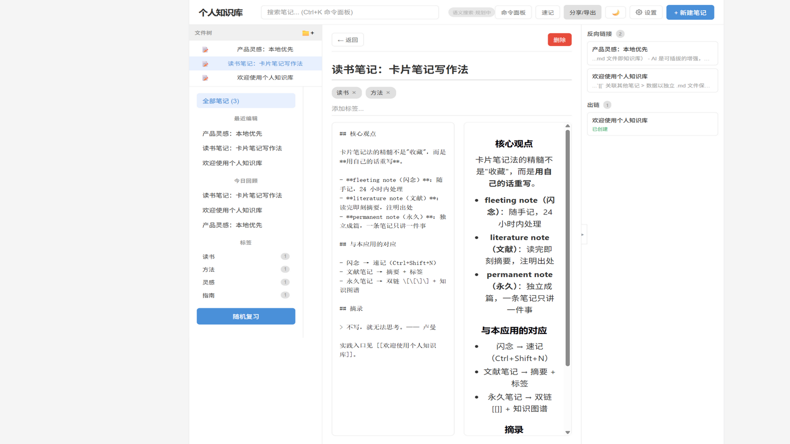
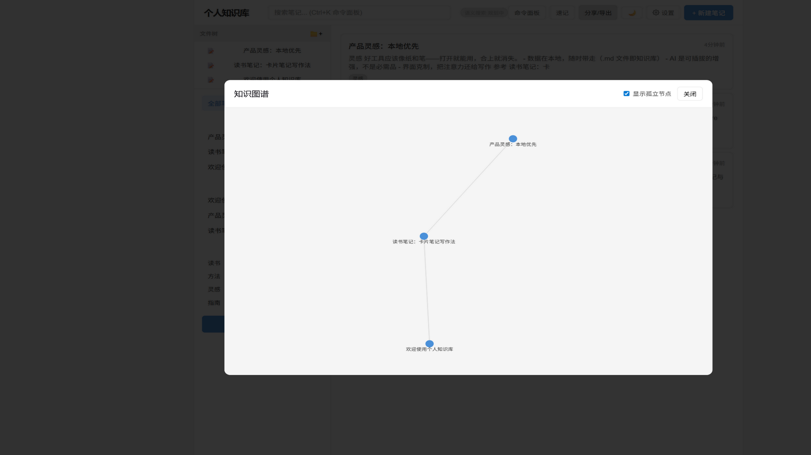
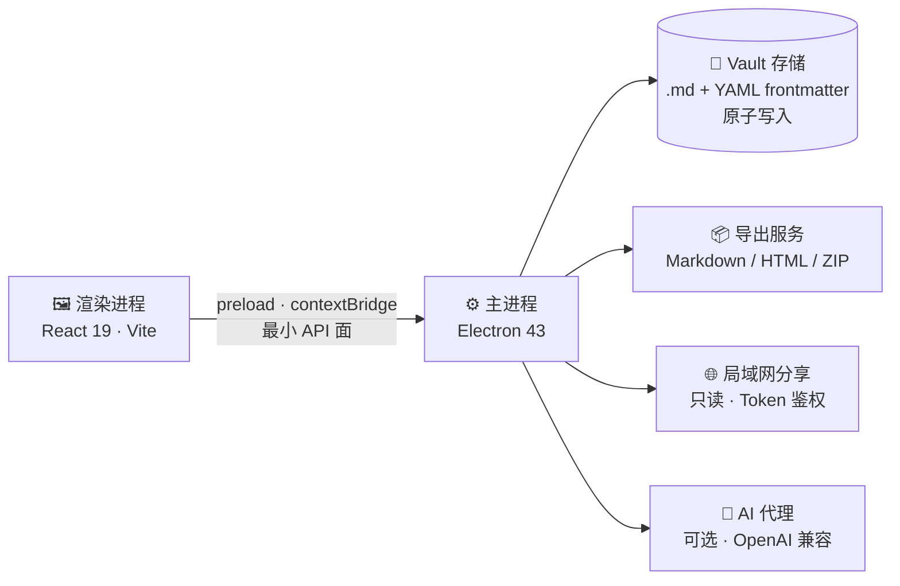

<div align="center">

# 🗂️ 个人知识库

**纯本地运行的 Obsidian 风格 Markdown 知识库 · 默认离线 · 数据归你所有**

[](https://www.electronjs.org/)
[](https://react.dev/)
[](https://www.typescriptlang.org/)
[](https://vite.dev/)
[](note-app/src/utils/__tests__)
[](note-app/package.json)

一个面向普通用户的桌面端知识管理工作台：像 Obsidian 一样强大，像记事本一样简单。
不登录、不上传、不同步 —— 你的笔记永远保存在你自己的电脑上。

</div>

---

## 🖼️ 界面预览

| 笔记编辑 · 实时预览 · 双链面板 | 知识图谱 |
| :---: | :---: |
|  |  |

## ✨ 功能特性

### 📝 笔记核心
- **Markdown 编辑**：分屏实时预览，500ms 防抖自动保存
- **文件夹与文件树**：笔记拖拽归类，独立 `.md` 文件存储（Obsidian 风格）
- **标签系统**：添加、统计、筛选，一键整理
- **全文搜索**：标题 / 正文 / 标签全覆盖

### 🔗 知识管理
- **`[[双链]]` 笔记**：支持 `[[链接|别名]]`，未创建的链接一键生成笔记
- **反向链接 / 出链面板**：随时看清一篇笔记的来龙去脉
- **知识图谱**：力导向布局可视化全部笔记关联，节点可拖拽
- **今日回顾 / 随机复习**：间隔复习，让旧笔记不再吃灰

### ⚡ 速记与 AI（可选）
- **速记面板**（`Ctrl+Shift+N`）：文本 / 链接 / 图片 / 语音随手记，本地模板一键整理
- **AI 增强**（默认关闭）：速记整理、摘要生成、标签推荐、图片 OCR、语音转写
  - 支持 OpenAI 兼容接口，也可指向本地模型（Ollama / LM Studio，免 API Key）
  - API Key 使用 Electron `safeStorage` 加密存储，明文不离开主进程
  - 未配置或调用失败时自动降级为本地行为，不影响任何功能

### 📤 导出与分享
- 导出范围：单篇笔记 / 当前文件夹 / 整个知识库
- 导出格式：Markdown 或 HTML，ZIP 压缩包或文件夹
- 笔记引用的图片附件自动复制并改写为相对路径，导出内容不含本机路径
- **局域网只读分享**：随机端口 + Token 鉴权，分享前弹窗确认范围，关闭应用自动停止

### ⌨️ 效率入口
| 快捷键 | 功能 | 快捷键 | 功能 |
| --- | --- | --- | --- |
| `Ctrl+K` | 命令面板 | `Ctrl+P` | 快速切换笔记 |
| `Ctrl+F` | 搜索 | `Ctrl+N` | 新建笔记 |
| `Ctrl+G` | 知识图谱 | `Ctrl+Shift+N` | 新建速记 |

## 🔒 隐私与安全

这个应用的核心理念：**默认离线、默认私有、分享必须由你主动触发。**

- 所有笔记数据保存在本机，不登录、不上传、不云端同步
- 渲染进程运行在 `contextIsolation` + 禁用 `nodeIntegration` 的沙箱中，文件读写全部经过主进程校验
- IPC 通道全量参数校验；文件访问带路径穿越防护；导出路径锁定在用户对话框选择的目录内
- 局域网分享只读、Token 鉴权、符号链接二次校验

## 🚀 快速开始

```bash
cd project_1/note-app
npm install
npm run electron:dev     # 同时启动 Vite 开发服务与 Electron 窗口
```

常用脚本：

| 命令 | 说明 |
| --- | --- |
| `npm run dev` | 仅启动渲染层开发服务（浏览器模式，数据存 localStorage） |
| `npm test` | 运行单元测试（Vitest） |
| `npm run lint` / `npm run typecheck` | 代码检查 / 类型检查 |
| `npm run build` | 生产构建 |
| `npm run electron:package` | 打包 Windows 安装版与便携版 |

### 📦 打包发布

```bash
npm run electron:package
```

产物输出到 `note-app/dist-desktop/`：

- `个人知识库 Setup 1.0.0.exe` —— NSIS 安装版
- `个人知识库-便携版.exe` —— 免安装便携版，双击即用

## 💾 数据存储

每篇笔记是一个独立的 `.md` 文件（YAML frontmatter + Markdown 正文），位于：

```text
%APPDATA%/personal-knowledge-notes/vault/
├── .vault-meta.json        # 文件夹元数据
├── attachments/            # 图片等附件
├── notes/                  # 根目录笔记
└── folders/<文件夹ID>/      # 分文件夹笔记
```

```yaml
---
id: "uuid"
title: "笔记标题"
tags: ["标签1", "标签2"]
folderId: "文件夹ID"
createdAt: "2026-05-01T10:00:00.000Z"
updatedAt: "2026-05-01T10:30:00.000Z"
---
Markdown 正文……
```

写入采用**原子写**（临时文件 + rename，含 Windows 兼容处理），不用担心写一半断电丢数据。
你的数据始终是纯文本，随时可以用任何编辑器打开、迁移或备份。

## 🧱 架构



## 📁 仓库内容

| 目录 | 说明 |
| --- | --- |
| [`project_1/note-app/`](project_1/note-app) | ⭐ **主项目**：个人知识库桌面应用（源码见 [`README`](project_1/note-app/README.md)） |
| [`project_1/个人知识库-笔记助手/`](project_1/个人知识库-笔记助手) | 项目笔记与需求文档 |
| `brain_computer/` · `nature-skills/` · `ui-ux-pro-max-skill/` | 其他个人资料与实验项目 |

## 🗺️ 路线图

- [x] Markdown 笔记 + 双链 + 知识图谱
- [x] 速记（文本 / 链接 / 图片 / 语音）
- [x] AI 增强（整理 / 摘要 / 标签 / OCR / 转写）
- [x] 导出与局域网分享
- [ ] 语义搜索

---

<div align="center">

**如果这个项目对你有帮助，欢迎点一个 ⭐ Star**

</div>
